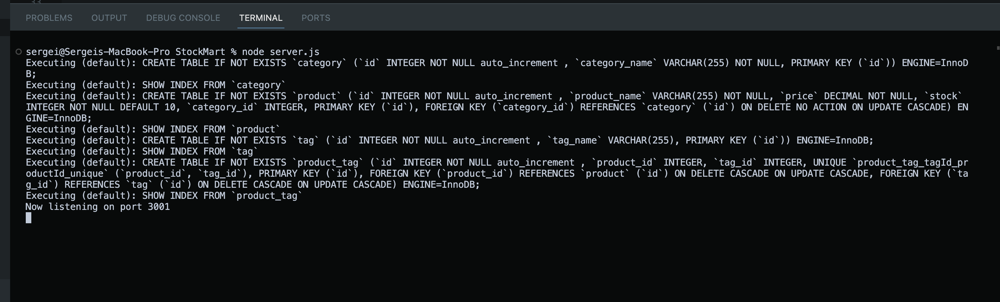

# StockMart

## Description

Application that provides all API routes for Categories, Products and their associated tags. Sequelize is used for all model building and handling of all database calls

## Table of Contents 

- [Installation](#installation)
- [Usage](#usage)
- [Credits](#credits)
- [License](#license)

## Installation

`npm i` to install all required dependencies, no further installation required. A schema run is required prior to runnning the application 

## Usage

`node server.js` to start the server and activate all of the API routes. Insomnia can be used to check the functionality of all the routes

## Credits

All work was done by Sergei Malyshka

## License

## Video Link
(https://drive.google.com/file/d/1ZU6UMzXGY81hFmXXA3CfQiLrNYJ6-LsZ/view)

